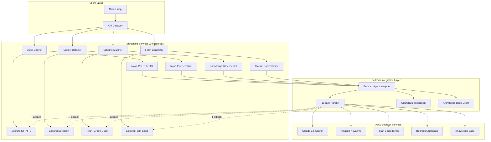
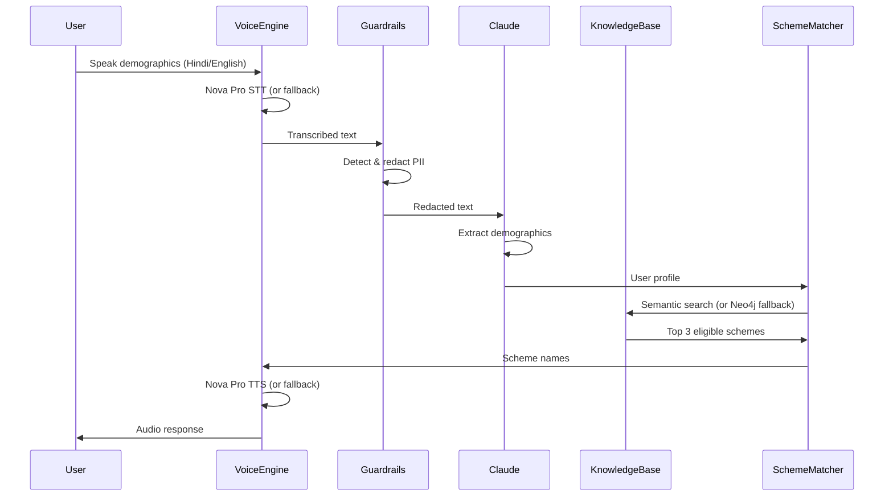
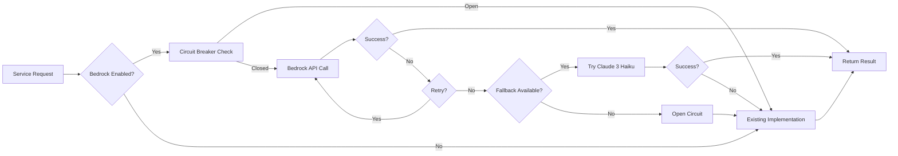

# Design Document: Bedrock Integration

## Overview

This design specifies the integration of AWS Bedrock capabilities into the existing gram-sahayak system as an incremental 24-hour MVP enhancement. The integration follows a hybrid architecture pattern where Bedrock models serve as enhanced options while existing implementations remain as resilient fallbacks.

The core architectural principle is **non-disruptive enhancement**: every service maintains its current functionality while gaining optional Bedrock-powered capabilities. This approach ensures zero downtime during rollout and provides automatic resilience during Bedrock service disruptions.

Key design decisions:
- **Hybrid Service Pattern**: Each service supports both existing and Bedrock implementations with runtime selection
- **Fallback-First Architecture**: Circuit breaker pattern with automatic degradation to existing services
- **Incremental Rollout**: Feature flags enable per-service Bedrock activation
- **MVP Scope**: Focus on voice-to-scheme-matching flow with 10-20 sample schemes
- **Language Support**: Hindi and English only for 24-hour MVP
- **Latency Target**: <3 seconds end-to-end for 90% of requests

The integration adds four primary Bedrock capabilities:
1. **Claude 3.5 Sonnet** for demographic extraction and conversational AI
2. **Amazon Nova Pro** for speech-to-text and text-to-speech
3. **Amazon Titan Embeddings** for semantic scheme search
4. **Bedrock Guardrails** for PII detection and redaction

## Architecture

### High-Level System Architecture



### Voice-to-Scheme-Matching Flow



### Fallback Architecture



## Components and Interfaces

### Bedrock Agent Wrapper

**Responsibilities:**
- Unified interface for all Bedrock model invocations
- Request/response transformation between service formats and Bedrock formats
- Credential management and authentication
- Request logging and metrics collection
- Error handling and exception translation

**Technology Stack:**
- AWS SDK for JavaScript v3 (TypeScript services)
- Boto3 (Python services)
- AWS Bedrock Runtime API
- AWS Bedrock Agent Runtime API

**Key Interfaces:**

```typescript
interface BedrockAgentWrapper {
  // Model invocation
  invokeClaudeModel(
    prompt: string,
    config: ClaudeConfig
  ): Promise<ClaudeResponse>;
  
  invokeNovaProSTT(
    audioData: ArrayBuffer,
    language: 'hi' | 'en'
  ): Promise<TranscriptionResult>;
  
  invokeNovaProTTS(
    text: string,
    language: 'hi' | 'en',
    voice: VoiceProfile
  ): Promise<AudioBuffer>;
  
  // Knowledge Base operations
  queryKnowledgeBase(
    query: string,
    filters: KBFilter[],
    maxResults: number
  ): Promise<KBResult[]>;
  
  // Guardrails
  applyGuardrails(
    text: string,
    policyId: string
  ): Promise<GuardrailsResult>;
  
  // Health and status
  checkHealth(): Promise<HealthStatus>;
  getMetrics(): Promise<BedrockMetrics>;
}

interface ClaudeConfig {
  modelId: string; // 'anthropic.claude-3-5-sonnet-20241022-v2:0'
  maxTokens: number;
  temperature: number;
  systemPrompt?: string;
}

interface ClaudeResponse {
  content: string;
  stopReason: string;
  usage: {
    inputTokens: number;
    outputTokens: number;
  };
  confidence?: number;
}

interface KBResult {
  content: string;
  metadata: Record<string, any>;
  score: number;
  sourceLocation: string;
}

interface GuardrailsResult {
  action: 'ALLOWED' | 'BLOCKED';
  outputText: string;
  piiDetections: PIIDetection[];
  assessments: Assessment[];
}

interface PIIDetection {
  type: string; // 'NAME', 'ADDRESS', 'PHONE', 'AADHAAR'
  match: string;
  startOffset: number;
  endOffset: number;
}
```

### Fallback Handler

**Responsibilities:**
- Circuit breaker pattern implementation for Bedrock services
- Automatic routing to fallback implementations
- Model tier fallback (Claude 3.5 Sonnet → Claude 3 Haiku → existing)
- Timeout management and deadline enforcement
- Fallback event logging and alerting

**Technology Stack:**
- Circuit breaker library (opossum for Node.js, pybreaker for Python)
- Redis for distributed circuit state
- Prometheus metrics for monitoring

**Key Interfaces:**

```typescript
interface FallbackHandler {
  // Execute with fallback
  executeWithFallback<T>(
    primary: () => Promise<T>,
    fallback: () => Promise<T>,
    options: FallbackOptions
  ): Promise<FallbackResult<T>>;
  
  // Circuit breaker management
  getCircuitState(serviceId: string): CircuitState;
  resetCircuit(serviceId: string): void;
  
  // Metrics
  getFallbackMetrics(): FallbackMetrics;
}

interface FallbackOptions {
  timeout: number; // milliseconds
  retries: number;
  retryDelay: number;
  circuitBreakerThreshold: number; // failure percentage
  circuitBreakerWindow: number; // time window in seconds
}

interface FallbackResult<T> {
  data: T;
  source: 'primary' | 'fallback';
  latency: number;
  attempts: number;
}

interface CircuitState {
  state: 'CLOSED' | 'OPEN' | 'HALF_OPEN';
  failureCount: number;
  successCount: number;
  lastFailureTime?: Date;
  nextAttemptTime?: Date;
}

interface FallbackMetrics {
  totalRequests: number;
  primarySuccesses: number;
  primaryFailures: number;
  fallbackSuccesses: number;
  fallbackFailures: number;
  averageLatency: number;
  circuitStates: Record<string, CircuitState>;
}
```

### Enhanced Voice Engine

**Responsibilities:**
- Hybrid STT: Nova Pro with fallback to existing IndicWhisper
- Hybrid TTS: Nova Pro with fallback to existing TTS models
- Audio preprocessing and quality assessment
- Language detection coordination with Dialect Detector

**Key Interfaces:**

```typescript
interface EnhancedVoiceEngine extends VoiceEngine {
  // Override with Bedrock enhancement
  processAudioStream(
    sessionId: string,
    audioChunk: ArrayBuffer
  ): Promise<TranscriptionResult>;
  
  synthesizeSpeech(
    text: string,
    dialect: DialectCode,
    voice: VoiceProfile
  ): Promise<AudioBuffer>;
  
  // Bedrock-specific methods
  setBedrockEnabled(enabled: boolean): void;
  getBedrockStatus(): BedrockServiceStatus;
}

interface BedrockServiceStatus {
  enabled: boolean;
  available: boolean;
  lastCheck: Date;
  fallbackActive: boolean;
}
```

### Enhanced Scheme Matcher

**Responsibilities:**
- Hybrid search: Knowledge Base semantic search with Neo4j fallback
- User profile to search query transformation
- Result ranking and deduplication
- Eligibility validation

**Key Interfaces:**

```typescript
interface EnhancedSchemeMatcher extends SchemeMatcher {
  // Override with Bedrock enhancement
  findEligibleSchemes(
    userProfile: UserProfile
  ): Promise<SchemeMatch[]>;
  
  // Bedrock-specific methods
  searchKnowledgeBase(
    query: string,
    profile: UserProfile
  ): Promise<KBSchemeResult[]>;
  
  mergeResults(
    kbResults: KBSchemeResult[],
    neo4jResults: SchemeMatch[]
  ): Promise<SchemeMatch[]>;
}

interface KBSchemeResult {
  schemeName: string;
  description: string;
  eligibilityCriteria: string;
  benefits: string;
  relevanceScore: number;
  language: 'hi' | 'en';
}
```

### Knowledge Base Ingestion Pipeline

**Responsibilities:**
- Scheme data validation and transformation
- Embedding generation using Titan
- Knowledge Base indexing
- Bilingual content management (Hindi/English)

**Key Interfaces:**

```typescript
interface KBIngestionPipeline {
  // Ingest schemes
  ingestSchemes(
    schemes: SchemeData[]
  ): Promise<IngestionResult>;
  
  // Validate scheme data
  validateScheme(
    scheme: SchemeData
  ): ValidationResult;
  
  // Generate embeddings
  generateEmbeddings(
    text: string,
    language: 'hi' | 'en'
  ): Promise<number[]>;
  
  // Status and monitoring
  getIngestionStatus(): IngestionStatus;
}

interface SchemeData {
  schemeId: string;
  name: {
    en: string;
    hi: string;
  };
  description: {
    en: string;
    hi: string;
  };
  eligibility: {
    ageMin?: number;
    ageMax?: number;
    incomeMax?: number;
    caste?: string[];
    gender?: string[];
    state?: string[];
    district?: string[];
  };
  benefits: {
    en: string;
    hi: string;
  };
  applicationProcess: {
    en: string;
    hi: string;
  };
}

interface IngestionResult {
  successCount: number;
  failureCount: number;
  errors: IngestionError[];
  duration: number;
}

interface ValidationResult {
  valid: boolean;
  errors: string[];
  warnings: string[];
}
```

### Guardrails Integration Layer

**Responsibilities:**
- PII detection in voice transcriptions
- PII redaction with placeholder tokens
- False positive logging and override mechanism
- Context restoration for final responses

**Key Interfaces:**

```typescript
interface GuardrailsIntegration {
  // PII protection
  detectAndRedactPII(
    text: string,
    language: 'hi' | 'en'
  ): Promise<PIIRedactionResult>;
  
  // Context management
  storePIIContext(
    sessionId: string,
    context: PIIContext
  ): Promise<void>;
  
  restorePIIContext(
    sessionId: string,
    text: string
  ): Promise<string>;
  
  // False positive handling
  logFalsePositive(
    detection: PIIDetection,
    reason: string
  ): Promise<void>;
  
  overrideGuardrails(
    sessionId: string,
    adminToken: string
  ): Promise<void>;
}

interface PIIRedactionResult {
  redactedText: string;
  detections: PIIDetection[];
  action: 'ALLOWED' | 'BLOCKED';
  confidence: number;
}

interface PIIContext {
  originalText: string;
  redactedText: string;
  detections: PIIDetection[];
  timestamp: Date;
}
```

## Data Models

### Bedrock Configuration

```typescript
interface BedrockConfig {
  enabled: boolean;
  region: string;
  credentials: {
    accessKeyId: string;
    secretAccessKey: string;
    sessionToken?: string;
  };
  models: {
    claude: {
      modelId: string; // 'anthropic.claude-3-5-sonnet-20241022-v2:0'
      fallbackModelId: string; // 'anthropic.claude-3-haiku-20240307-v1:0'
      maxTokens: number;
      temperature: number;
    };
    novaPro: {
      sttModelId: string;
      ttsModelId: string;
      supportedLanguages: string[];
    };
    titanEmbeddings: {
      modelId: string;
      dimensions: number;
    };
  };
  guardrails: {
    policyId: string;
    policyVersion: string;
    enabledDetectors: string[];
  };
  knowledgeBase: {
    kbId: string;
    dataSourceId: string;
    maxResults: number;
  };
  fallback: {
    timeout: number;
    retries: number;
    circuitBreakerThreshold: number;
    circuitBreakerWindow: number;
  };
  monitoring: {
    enableMetrics: boolean;
    enableTracing: boolean;
    logLevel: 'debug' | 'info' | 'warn' | 'error';
  };
}
```

### Enhanced User Profile

```typescript
interface EnhancedUserProfile extends UserProfile {
  // Additional fields for Bedrock integration
  bedrockMetadata?: {
    extractionConfidence: number;
    extractionModel: string;
    extractionTimestamp: Date;
    piiRedacted: boolean;
  };
}
```

### Scheme Metadata for Knowledge Base

```typescript
interface KBSchemeMetadata {
  schemeId: string;
  name: string;
  language: 'hi' | 'en';
  eligibility: {
    ageMin?: number;
    ageMax?: number;
    incomeMax?: number;
    caste?: string[];
    gender?: string[];
    state?: string[];
    district?: string[];
  };
  benefits: {
    type: string;
    amount?: number;
    description: string;
  };
  applicationDifficulty: 'easy' | 'medium' | 'hard';
  lastUpdated: Date;
  source: string;
}
```

### Monitoring Metrics

```typescript
interface BedrockMetrics {
  // API metrics
  apiCalls: {
    total: number;
    byModel: Record<string, number>;
    byStatus: Record<string, number>;
  };
  
  // Latency metrics
  latency: {
    average: number;
    p50: number;
    p95: number;
    p99: number;
    byModel: Record<string, LatencyStats>;
  };
  
  // Cost metrics
  costs: {
    total: number;
    byModel: Record<string, number>;
    inputTokens: number;
    outputTokens: number;
  };
  
  // Fallback metrics
  fallbacks: {
    total: number;
    byService: Record<string, number>;
    byReason: Record<string, number>;
  };
  
  // Guardrails metrics
  guardrails: {
    totalChecks: number;
    piiDetections: number;
    blockedRequests: number;
    falsePositives: number;
  };
  
  // Knowledge Base metrics
  knowledgeBase: {
    queries: number;
    averageResults: number;
    averageRelevanceScore: number;
  };
}

interface LatencyStats {
  count: number;
  average: number;
  min: number;
  max: number;
  p50: number;
  p95: number;
  p99: number;
}
```

### Sample Scheme Set

```typescript
interface SampleSchemeSet {
  schemes: SchemeData[];
  metadata: {
    version: string;
    createdAt: Date;
    totalSchemes: number;
    languages: string[];
    categories: string[];
  };
}

// Example schemes for MVP
const MVP_SAMPLE_SCHEMES: SchemeData[] = [
  {
    schemeId: 'PM-KISAN',
    name: {
      en: 'PM-KISAN (Farmer Income Support)',
      hi: 'पीएम-किसान (किसान आय सहायता)'
    },
    description: {
      en: 'Direct income support of ₹6000 per year to farmer families',
      hi: 'किसान परिवारों को प्रति वर्ष ₹6000 की प्रत्यक्ष आय सहायता'
    },
    eligibility: {
      incomeMax: 200000,
      state: ['all']
    },
    benefits: {
      en: '₹6000 per year in three installments',
      hi: 'तीन किस्तों में प्रति वर्ष ₹6000'
    },
    applicationProcess: {
      en: 'Apply online at pmkisan.gov.in with land records',
      hi: 'भूमि रिकॉर्ड के साथ pmkisan.gov.in पर ऑनलाइन आवेदन करें'
    }
  },
  // ... 9-19 more schemes
];
```


## API Specifications

### Bedrock Model Invocation APIs

**Claude Model Invocation**

```typescript
POST /bedrock/claude/invoke
Content-Type: application/json

Request:
{
  "prompt": "Extract demographics from: मेरा नाम राज है, मैं 45 साल का हूं...",
  "systemPrompt": "You are a demographic extraction assistant...",
  "config": {
    "maxTokens": 1000,
    "temperature": 0.3
  }
}

Response:
{
  "content": "{\"age\": 45, \"name\": \"[REDACTED]\", ...}",
  "stopReason": "end_turn",
  "usage": {
    "inputTokens": 150,
    "outputTokens": 80
  },
  "confidence": 0.92,
  "latency": 850
}
```

**Nova Pro STT**

```typescript
POST /bedrock/nova-pro/stt
Content-Type: multipart/form-data

Request:
{
  "audio": <binary audio data>,
  "language": "hi",
  "sampleRate": 16000
}

Response:
{
  "transcription": "मेरा नाम राज है",
  "confidence": 0.89,
  "language": "hi",
  "duration": 2.5,
  "latency": 450
}
```

**Nova Pro TTS**

```typescript
POST /bedrock/nova-pro/tts
Content-Type: application/json

Request:
{
  "text": "आपके लिए तीन योजनाएं मिलीं",
  "language": "hi",
  "voice": {
    "gender": "female",
    "style": "conversational"
  }
}

Response:
{
  "audio": <base64 encoded audio>,
  "format": "mp3",
  "sampleRate": 24000,
  "duration": 3.2,
  "latency": 520
}
```

**Knowledge Base Query**

```typescript
POST /bedrock/knowledge-base/query
Content-Type: application/json

Request:
{
  "query": "schemes for 45 year old farmer with income below 2 lakh",
  "filters": [
    {
      "key": "eligibility.ageMin",
      "operator": "<=",
      "value": 45
    },
    {
      "key": "eligibility.ageMax",
      "operator": ">=",
      "value": 45
    }
  ],
  "maxResults": 3,
  "language": "en"
}

Response:
{
  "results": [
    {
      "content": "PM-KISAN provides ₹6000 per year...",
      "metadata": {
        "schemeId": "PM-KISAN",
        "name": "PM-KISAN (Farmer Income Support)",
        "eligibility": {...}
      },
      "score": 0.87,
      "sourceLocation": "s3://kb-bucket/schemes/pm-kisan.json"
    }
  ],
  "totalResults": 3,
  "latency": 320
}
```

**Guardrails Check**

```typescript
POST /bedrock/guardrails/check
Content-Type: application/json

Request:
{
  "text": "My name is Raj Kumar and my Aadhaar is 1234-5678-9012",
  "policyId": "pii-detection-policy-v1",
  "language": "en"
}

Response:
{
  "action": "ALLOWED",
  "outputText": "My name is [NAME] and my Aadhaar is [AADHAAR]",
  "piiDetections": [
    {
      "type": "NAME",
      "match": "Raj Kumar",
      "startOffset": 11,
      "endOffset": 20
    },
    {
      "type": "AADHAAR",
      "match": "1234-5678-9012",
      "startOffset": 42,
      "endOffset": 56
    }
  ],
  "assessments": [
    {
      "topicPolicy": "PII_PROTECTION",
      "action": "REDACTED"
    }
  ],
  "latency": 180
}
```

### Enhanced Service APIs (Backward Compatible)

**Enhanced Voice Engine**

```typescript
// Existing endpoint with Bedrock enhancement
POST /session/start
Content-Type: application/json

Request:
{
  "userId": "user-123",
  "preferredLanguage": "hi",
  "bedrockEnabled": true  // New optional field
}

Response:
{
  "sessionId": "session-456",
  "bedrockStatus": {
    "enabled": true,
    "available": true,
    "models": ["nova-pro-stt", "nova-pro-tts"]
  }
}

// New endpoint for Bedrock status
GET /bedrock/status

Response:
{
  "enabled": true,
  "available": true,
  "models": {
    "stt": {
      "primary": "nova-pro",
      "fallback": "indic-whisper",
      "status": "healthy"
    },
    "tts": {
      "primary": "nova-pro",
      "fallback": "indic-tts",
      "status": "healthy"
    }
  },
  "circuitBreaker": {
    "state": "CLOSED",
    "failureRate": 0.02
  }
}
```

**Enhanced Scheme Matcher**

```typescript
// Existing endpoint with Bedrock enhancement
POST /schemes/find
Content-Type: application/json

Request:
{
  "userId": "user-123",
  "personalInfo": {...},
  "demographics": {...},
  "economic": {...},
  "preferences": {
    "preferredLanguage": "hi",
    "useBedrockSearch": true  // New optional field
  }
}

Response:
{
  "schemes": [
    {
      "schemeId": "PM-KISAN",
      "name": "पीएम-किसान",
      "matchScore": 0.92,
      "source": "knowledge-base",  // New field
      "eligibilityStatus": "eligible"
    }
  ],
  "searchMetadata": {
    "source": "knowledge-base",
    "fallbackUsed": false,
    "latency": 320
  }
}
```

### Fallback Routing APIs

```typescript
// Internal API for fallback handler
POST /internal/fallback/execute
Content-Type: application/json

Request:
{
  "serviceId": "voice-engine-stt",
  "primaryEndpoint": "/bedrock/nova-pro/stt",
  "fallbackEndpoint": "/existing/stt",
  "payload": {...},
  "options": {
    "timeout": 3000,
    "retries": 2,
    "circuitBreakerThreshold": 0.5
  }
}

Response:
{
  "data": {...},
  "source": "primary" | "fallback",
  "latency": 450,
  "attempts": 1,
  "circuitState": "CLOSED"
}

// Circuit breaker management
GET /internal/fallback/circuit/:serviceId

Response:
{
  "serviceId": "voice-engine-stt",
  "state": "CLOSED",
  "failureCount": 2,
  "successCount": 98,
  "failureRate": 0.02,
  "lastFailureTime": "2024-01-15T10:30:00Z",
  "nextAttemptTime": null
}

POST /internal/fallback/circuit/:serviceId/reset

Response:
{
  "serviceId": "voice-engine-stt",
  "state": "CLOSED",
  "message": "Circuit breaker reset successfully"
}
```

### Health Check and Monitoring APIs

```typescript
// Bedrock integration health
GET /health/bedrock

Response:
{
  "status": "healthy",
  "services": {
    "claude": {
      "available": true,
      "latency": 850,
      "lastCheck": "2024-01-15T10:35:00Z"
    },
    "novaPro": {
      "available": true,
      "latency": 450,
      "lastCheck": "2024-01-15T10:35:00Z"
    },
    "knowledgeBase": {
      "available": true,
      "latency": 320,
      "lastCheck": "2024-01-15T10:35:00Z"
    },
    "guardrails": {
      "available": true,
      "latency": 180,
      "lastCheck": "2024-01-15T10:35:00Z"
    }
  },
  "credentials": {
    "valid": true,
    "expiresAt": "2024-01-16T10:00:00Z"
  }
}

// Metrics endpoint (Prometheus format)
GET /metrics/bedrock

Response (text/plain):
# HELP bedrock_api_calls_total Total number of Bedrock API calls
# TYPE bedrock_api_calls_total counter
bedrock_api_calls_total{model="claude"} 1250
bedrock_api_calls_total{model="nova-pro-stt"} 890
bedrock_api_calls_total{model="nova-pro-tts"} 890
bedrock_api_calls_total{model="knowledge-base"} 450

# HELP bedrock_api_latency_seconds API call latency
# TYPE bedrock_api_latency_seconds histogram
bedrock_api_latency_seconds_bucket{model="claude",le="0.5"} 120
bedrock_api_latency_seconds_bucket{model="claude",le="1.0"} 980
bedrock_api_latency_seconds_bucket{model="claude",le="2.0"} 1240

# HELP bedrock_fallback_total Total number of fallback invocations
# TYPE bedrock_fallback_total counter
bedrock_fallback_total{service="voice-engine",reason="timeout"} 12
bedrock_fallback_total{service="scheme-matcher",reason="error"} 5

# HELP bedrock_guardrails_pii_detections_total PII detections
# TYPE bedrock_guardrails_pii_detections_total counter
bedrock_guardrails_pii_detections_total{type="NAME"} 450
bedrock_guardrails_pii_detections_total{type="AADHAAR"} 230
bedrock_guardrails_pii_detections_total{type="PHONE"} 180

# HELP bedrock_cost_usd_total Total cost in USD
# TYPE bedrock_cost_usd_total counter
bedrock_cost_usd_total{model="claude"} 12.50
bedrock_cost_usd_total{model="nova-pro"} 3.20
bedrock_cost_usd_total{model="titan-embeddings"} 0.80
```

### Configuration Management APIs

```typescript
// Get current configuration
GET /config/bedrock

Response:
{
  "enabled": true,
  "region": "us-east-1",
  "models": {
    "claude": {
      "modelId": "anthropic.claude-3-5-sonnet-20241022-v2:0",
      "fallbackModelId": "anthropic.claude-3-haiku-20240307-v1:0"
    }
  },
  "fallback": {
    "timeout": 3000,
    "retries": 2
  }
}

// Update configuration (admin only)
PUT /config/bedrock
Content-Type: application/json

Request:
{
  "enabled": true,
  "models": {
    "claude": {
      "temperature": 0.5
    }
  }
}

Response:
{
  "success": true,
  "message": "Configuration updated successfully",
  "restartRequired": false
}

// Enable/disable Bedrock per service
POST /config/bedrock/services/:serviceId/toggle
Content-Type: application/json

Request:
{
  "enabled": true
}

Response:
{
  "serviceId": "voice-engine",
  "bedrockEnabled": true,
  "message": "Bedrock enabled for voice-engine"
}
```


## Correctness Properties

*A property is a characteristic or behavior that should hold true across all valid executions of a system—essentially, a formal statement about what the system should do. Properties serve as the bridge between human-readable specifications and machine-verifiable correctness guarantees.*

### Property Reflection

After analyzing all acceptance criteria, I identified several areas of redundancy:

- Properties 1.1-1.4 (model invocation) can be combined into a single property about correct API invocation
- Properties 2.1-2.4 (hybrid support) can be combined into a single property about dual implementation support
- Properties 6.1-6.5 (language support) can be combined into comprehensive language processing properties
- Properties 8.1-8.3 (validation) can be combined into a single validation property
- Properties 11.1-11.5 (metrics) can be combined into a single metrics collection property

The following properties represent the unique, non-redundant correctness guarantees:

### Property 1: Bedrock Model Invocation Correctness

*For any* supported operation (STT, TTS, demographic extraction, semantic search), when Bedrock is enabled, the system should invoke the correct Bedrock model with properly formatted requests and handle responses according to the model's specification.

**Validates: Requirements 1.1, 1.2, 1.3, 1.4**

### Property 2: Fallback Routing on Failure

*For any* Bedrock model invocation that fails (timeout, error, rate limit), the Fallback_Handler should automatically route the request to the existing service implementation and complete the routing within 100 milliseconds.

**Validates: Requirements 1.5, 1.6, 7.1, 7.2**

### Property 3: Model Tier Fallback Sequence

*For any* Claude model invocation failure, the system should attempt Claude 3 Haiku before falling back to the existing implementation, maintaining the fallback sequence: Claude 3.5 Sonnet → Claude 3 Haiku → Existing.

**Validates: Requirements 1.7**

### Property 4: Hybrid Implementation Support

*For any* enhanced service (Voice Engine, Dialect Detector, Scheme Matcher, Form Generator), the service should support both Bedrock and existing implementations, with both implementations producing valid results for the same input.

**Validates: Requirements 2.1, 2.2, 2.3, 2.4**

### Property 5: Bedrock Priority When Enabled

*For any* service request when Bedrock integration is enabled, the system should attempt the Bedrock implementation first, and only use the existing implementation if Bedrock fails or is unavailable.

**Validates: Requirements 2.5, 2.7**

### Property 6: Data Preservation During Integration

*For any* Neo4j scheme data existing before Bedrock integration, all data should remain intact and queryable after integration, with no data loss or corruption.

**Validates: Requirements 2.6**

### Property 7: Knowledge Base Result Limiting

*For any* user profile query to the Knowledge Base, the system should return at most 3 eligible schemes, ranked by relevance score in descending order.

**Validates: Requirements 3.3, 5.4**

### Property 8: Bilingual Knowledge Base Support

*For any* scheme in the Knowledge Base, the scheme should have descriptions in both Hindi and English, and semantic search should work correctly in both languages.

**Validates: Requirements 3.4, 6.5**

### Property 9: Scheme Data Validation

*For any* scheme submitted to the ingestion pipeline, the system should validate that all required fields (name, description, eligibility criteria, benefits) are present and non-empty before indexing.

**Validates: Requirements 3.6**

### Property 10: Eligibility Metadata Queryability

*For any* eligibility criterion (age, income, location, caste, gender), the Knowledge Base should support filtering schemes by that criterion through metadata queries.

**Validates: Requirements 3.7**

### Property 11: PII Detection and Redaction

*For any* text containing PII (names, addresses, phone numbers, Aadhaar numbers), the Guardrails_Service should detect the PII and replace it with placeholder tokens in the output.

**Validates: Requirements 4.1, 4.2, 4.3**

### Property 12: PII-Protected Processing Flow

*For any* user input containing PII, the system should redact PII before demographic extraction, process the request with redacted data, and only restore PII context when generating the final user response.

**Validates: Requirements 4.6, 4.7, 5.7**

### Property 13: End-to-End Voice Flow Correctness

*For any* user speaking demographics in Hindi or English, the system should transcribe using Nova Pro, extract demographics using Claude, query Knowledge Base for schemes, and synthesize the response in the same language as the input.

**Validates: Requirements 5.1, 5.2, 5.3, 5.5, 6.8**

### Property 14: End-to-End Latency Target

*For any* 100 consecutive end-to-end voice-to-scheme-matching requests, at least 90 requests should complete within 3 seconds from audio input to audio output.

**Validates: Requirements 5.6**

### Property 15: Transcription Accuracy Thresholds

*For any* audio sample in Hindi or English with known ground truth transcription, Nova Pro should achieve at least 85% accuracy for Hindi and 90% accuracy for English.

**Validates: Requirements 6.1, 6.2**

### Property 16: Multilingual Demographic Extraction

*For any* text containing demographic information in Hindi or English, Claude should successfully extract age, income, location, and family details into a valid User_Profile structure.

**Validates: Requirements 6.3, 6.4**

### Property 17: Network Failure Detection Speed

*For any* network connectivity failure to Bedrock, the Fallback_Handler should detect the failure and initiate fallback routing within 500 milliseconds.

**Validates: Requirements 7.3**

### Property 18: Fallback Event Logging

*For any* fallback event (Bedrock failure, timeout, rate limit), the system should log the event with timestamp, service name, error details, and fallback destination.

**Validates: Requirements 7.4**

### Property 19: Continuous Operation During Bedrock Outage

*For any* period when Bedrock is completely unavailable, the system should continue operating using existing implementations for all services without user-facing errors.

**Validates: Requirements 7.5**

### Property 20: Automatic Recovery After Outage

*For any* Bedrock service that becomes available after being unavailable, the system should automatically resume using Bedrock models within the next request cycle without manual intervention.

**Validates: Requirements 7.6**

### Property 21: Model Response Validation

*For any* model response (Claude demographic extraction, Nova Pro transcription, Knowledge Base search), the system should validate that required fields are present and non-empty, and invoke the Fallback_Handler if validation fails.

**Validates: Requirements 8.1, 8.2, 8.3, 8.4**

### Property 22: Quality Comparison Measurement

*For any* request processed by both Bedrock and existing implementations, the system should measure and log the quality metrics (accuracy, completeness, confidence) for comparison.

**Validates: Requirements 8.5, 8.6**

### Property 23: Confidence Score Threshold

*For any* model response with a confidence score below 70%, the system should reject the response and invoke the Fallback_Handler to retry with an alternative implementation.

**Validates: Requirements 8.7**

### Property 24: Comprehensive Metrics Collection

*For any* Bedrock API invocation, the system should collect and expose metrics including latency, cost, success/failure counts, and fallback counts through Prometheus-compatible endpoints.

**Validates: Requirements 11.1, 11.2, 11.3, 11.4, 11.5**

### Property 25: Voice Transcription Round-Trip

*For any* valid User_Profile, converting it to natural language text, synthesizing to audio using Nova Pro TTS, then transcribing back using Nova Pro STT, and extracting demographics using Claude should produce a User_Profile with equivalent demographic information (allowing for minor variations in phrasing).

**Validates: Requirements 1.2, 1.3, 5.1, 5.5**


## Error Handling

The Bedrock integration implements comprehensive error handling across all failure modes:

### Bedrock API Errors

**Authentication Failures:**
- Invalid credentials → Log error, disable Bedrock integration, use existing implementations
- Expired credentials → Attempt credential refresh, fallback if refresh fails
- Insufficient permissions → Log error with required permissions, disable affected models

**Rate Limiting:**
- Throttling errors → Implement exponential backoff with jitter
- Quota exceeded → Switch to fallback implementation, emit alert
- Burst limit reached → Queue requests with priority ordering

**Model Invocation Errors:**
- Model not found → Log error, attempt fallback model, then existing implementation
- Invalid request format → Log request details, fix formatting, retry once
- Timeout → Cancel request after configured timeout, invoke fallback
- Service unavailable → Open circuit breaker, route to fallback

**Response Validation Errors:**
- Missing required fields → Log validation error, invoke fallback
- Malformed JSON → Log response, attempt parsing with lenient parser, fallback if fails
- Low confidence score → Log score, invoke fallback for higher quality result
- Empty response → Log error, invoke fallback

### Knowledge Base Errors

**Query Errors:**
- No results found → Return empty list with explanation, suggest broadening criteria
- Query timeout → Fallback to Neo4j graph query
- Invalid filter syntax → Log error, retry with simplified filters
- Embedding generation failure → Use cached embeddings or fallback to keyword search

**Ingestion Errors:**
- Invalid scheme data → Log validation errors, skip scheme, continue with others
- Duplicate scheme ID → Update existing scheme with new data
- Embedding generation failure → Retry with exponential backoff, skip if persistent failure
- Storage failure → Rollback transaction, retry entire batch

### Guardrails Errors

**PII Detection Errors:**
- Guardrails service unavailable → Log warning, proceed without PII protection (with audit log)
- False positive detection → Log for review, provide override mechanism for admins
- Detection timeout → Proceed with partial detection results
- Unsupported language → Skip PII detection, log warning

**Redaction Errors:**
- Context restoration failure → Return redacted version with warning
- Placeholder collision → Use unique placeholder tokens with UUIDs
- Partial redaction → Log incomplete redaction, proceed with available redactions

### Fallback Handler Errors

**Circuit Breaker States:**
- CLOSED → Normal operation, track failure rate
- OPEN → All requests route to fallback, periodic health checks
- HALF_OPEN → Test requests to Bedrock, close on success or reopen on failure

**Fallback Failures:**
- Both Bedrock and fallback fail → Return error to user with retry suggestion
- Fallback timeout → Return partial results if available
- Fallback unavailable → Return cached results if available, otherwise error

### Network Errors

**Connectivity Issues:**
- DNS resolution failure → Retry with alternative DNS, fallback after 3 attempts
- Connection timeout → Reduce timeout threshold, invoke fallback
- SSL/TLS errors → Log certificate details, attempt without certificate validation (dev only)
- Network partition → Detect using health checks, route all traffic to fallback

**Latency Issues:**
- Slow response → Log latency warning, continue waiting until timeout
- Intermittent delays → Track latency percentiles, open circuit if p95 exceeds threshold
- Regional outage → Attempt alternative AWS region if configured

### Configuration Errors

**Startup Validation:**
- Missing required config → Log error, disable Bedrock integration
- Invalid model IDs → Validate against Bedrock API, disable invalid models
- Invalid region → Log error, attempt default region (us-east-1)
- Missing credentials → Log error, start with Bedrock disabled

**Runtime Configuration Changes:**
- Invalid config update → Reject update, return validation errors
- Config reload failure → Keep existing config, log error
- Inconsistent config state → Validate consistency, rollback if invalid

### Monitoring and Alerting

**Alert Conditions:**
- Fallback rate > 20% for 5 minutes → Page on-call engineer
- Circuit breaker open for > 10 minutes → Alert DevOps team
- PII detection false positive rate > 10% → Alert security team
- End-to-end latency p95 > 5 seconds → Alert performance team
- Bedrock API costs > daily budget → Alert finance team

**Error Aggregation:**
- Group similar errors by type and service
- Track error rates and trends over time
- Correlate errors with deployments and config changes
- Generate daily error summary reports


## Testing Strategy

The testing approach combines unit testing for specific scenarios with property-based testing for comprehensive coverage across the Bedrock integration.

### Unit Testing Focus

Unit tests validate specific examples, edge cases, and integration points:

**Bedrock Agent Wrapper:**
- Successful Claude model invocation with valid response
- Nova Pro STT with Hindi and English audio samples
- Nova Pro TTS with Hindi and English text samples
- Titan Embeddings generation for sample queries
- Knowledge Base query with specific filters
- Guardrails PII detection with known PII examples
- Authentication with valid and invalid credentials
- Request timeout handling
- Response parsing for various formats

**Fallback Handler:**
- Circuit breaker state transitions (CLOSED → OPEN → HALF_OPEN → CLOSED)
- Fallback routing on Bedrock timeout
- Fallback routing on Bedrock error response
- Model tier fallback (Claude 3.5 Sonnet → Claude 3 Haiku → Existing)
- Fallback completion within 100ms threshold
- Metrics collection for fallback events
- Circuit breaker reset functionality

**Enhanced Services:**
- Voice Engine with Bedrock enabled vs disabled
- Scheme Matcher with Knowledge Base vs Neo4j
- Dialect Detector with Nova Pro vs existing
- Form Generator with Claude vs existing
- Service configuration toggle
- Health check endpoints

**Knowledge Base Ingestion:**
- Valid scheme ingestion success
- Invalid scheme rejection with validation errors
- Duplicate scheme handling
- Bilingual content indexing
- Embedding generation
- Metadata extraction and storage

**Guardrails Integration:**
- PII detection for names, addresses, phones, Aadhaar numbers
- PII redaction with placeholder tokens
- Context storage and restoration
- False positive logging
- Admin override mechanism

**Edge Cases:**
- Empty audio input
- Very long text input (>10,000 characters)
- Unsupported language input
- Malformed API responses
- Network partition during request
- Concurrent requests with circuit breaker state changes
- Configuration changes during active requests

### Property-Based Testing Configuration

**Framework Selection:**
- TypeScript services: fast-check
- Python services: Hypothesis
- Minimum 100 iterations per property test
- Custom generators for domain-specific data

**Property Test Implementation:**

Each correctness property will be implemented as a single property-based test:

**Property 1: Bedrock Model Invocation Correctness**
```typescript
// Feature: bedrock-integration, Property 1: Bedrock Model Invocation Correctness
test('Bedrock models invoked correctly for all operations', async () => {
  await fc.assert(
    fc.asyncProperty(
      fc.oneof(
        fc.constant('stt'),
        fc.constant('tts'),
        fc.constant('extraction'),
        fc.constant('search')
      ),
      fc.record({
        audio: fc.uint8Array({ minLength: 1000, maxLength: 10000 }),
        text: fc.string({ minLength: 10, maxLength: 1000 }),
        language: fc.oneof(fc.constant('hi'), fc.constant('en'))
      }),
      async (operation, input) => {
        const wrapper = new BedrockAgentWrapper(testConfig);
        let result;
        
        switch (operation) {
          case 'stt':
            result = await wrapper.invokeNovaProSTT(input.audio.buffer, input.language);
            expect(result.transcription).toBeDefined();
            break;
          case 'tts':
            result = await wrapper.invokeNovaProTTS(input.text, input.language, defaultVoice);
            expect(result.byteLength).toBeGreaterThan(0);
            break;
          case 'extraction':
            result = await wrapper.invokeClaudeModel(input.text, defaultConfig);
            expect(result.content).toBeDefined();
            break;
          case 'search':
            result = await wrapper.queryKnowledgeBase(input.text, [], 3);
            expect(Array.isArray(result)).toBe(true);
            break;
        }
      }
    ),
    { numRuns: 100 }
  );
});
```

**Property 2: Fallback Routing on Failure**
```typescript
// Feature: bedrock-integration, Property 2: Fallback Routing on Failure
test('Fallback handler routes to existing implementation on any failure', async () => {
  await fc.assert(
    fc.asyncProperty(
      fc.oneof(
        fc.constant('timeout'),
        fc.constant('error'),
        fc.constant('rate_limit')
      ),
      fc.record({
        serviceId: fc.constantFrom('voice-engine', 'scheme-matcher', 'dialect-detector'),
        payload: fc.object()
      }),
      async (failureType, request) => {
        const handler = new FallbackHandler(testConfig);
        const startTime = Date.now();
        
        const primary = async () => {
          throw new Error(failureType);
        };
        
        const fallback = async () => {
          return { success: true, source: 'fallback' };
        };
        
        const result = await handler.executeWithFallback(primary, fallback, defaultOptions);
        const duration = Date.now() - startTime;
        
        expect(result.source).toBe('fallback');
        expect(duration).toBeLessThan(100);
      }
    ),
    { numRuns: 100 }
  );
});
```

**Property 7: Knowledge Base Result Limiting**
```typescript
// Feature: bedrock-integration, Property 7: Knowledge Base Result Limiting
test('Knowledge Base returns at most 3 schemes ranked by relevance', async () => {
  await fc.assert(
    fc.asyncProperty(
      generateUserProfile(),
      async (profile) => {
        const matcher = new EnhancedSchemeMatcher(testConfig);
        const results = await matcher.findEligibleSchemes(profile);
        
        expect(results.length).toBeLessThanOrEqual(3);
        
        // Verify ranking by relevance score
        for (let i = 1; i < results.length; i++) {
          expect(results[i - 1].matchScore).toBeGreaterThanOrEqual(results[i].matchScore);
        }
      }
    ),
    { numRuns: 100 }
  );
});
```

**Property 11: PII Detection and Redaction**
```typescript
// Feature: bedrock-integration, Property 11: PII Detection and Redaction
test('Guardrails detects and redacts all PII types', async () => {
  await fc.assert(
    fc.asyncProperty(
      fc.record({
        text: fc.string({ minLength: 20, maxLength: 200 }),
        name: fc.fullName(),
        phone: fc.phoneNumber(),
        aadhaar: fc.aadhaarNumber(),
        address: fc.address()
      }),
      async (data) => {
        const textWithPII = `${data.text} My name is ${data.name}, phone ${data.phone}, Aadhaar ${data.aadhaar}, address ${data.address}`;
        
        const guardrails = new GuardrailsIntegration(testConfig);
        const result = await guardrails.detectAndRedactPII(textWithPII, 'en');
        
        expect(result.redactedText).not.toContain(data.name);
        expect(result.redactedText).not.toContain(data.phone);
        expect(result.redactedText).not.toContain(data.aadhaar);
        expect(result.redactedText).not.toContain(data.address);
        expect(result.detections.length).toBeGreaterThan(0);
      }
    ),
    { numRuns: 100 }
  );
});
```

**Property 14: End-to-End Latency Target**
```typescript
// Feature: bedrock-integration, Property 14: End-to-End Latency Target
test('90% of requests complete within 3 seconds', async () => {
  const latencies: number[] = [];
  
  for (let i = 0; i < 100; i++) {
    const profile = generateRandomUserProfile();
    const audio = generateRandomAudio(profile, 'hi');
    
    const startTime = Date.now();
    await endToEndVoiceFlow(audio);
    const latency = Date.now() - startTime;
    
    latencies.push(latency);
  }
  
  latencies.sort((a, b) => a - b);
  const p90 = latencies[89]; // 90th percentile
  
  expect(p90).toBeLessThan(3000);
});
```

**Property 25: Voice Transcription Round-Trip**
```typescript
// Feature: bedrock-integration, Property 25: Voice Transcription Round-Trip
test('Round-trip voice processing preserves demographic information', async () => {
  await fc.assert(
    fc.asyncProperty(
      generateUserProfile(),
      async (originalProfile) => {
        // Convert profile to natural language
        const text = profileToNaturalLanguage(originalProfile, 'hi');
        
        // Synthesize to audio
        const wrapper = new BedrockAgentWrapper(testConfig);
        const audio = await wrapper.invokeNovaProTTS(text, 'hi', defaultVoice);
        
        // Transcribe back to text
        const transcription = await wrapper.invokeNovaProSTT(audio, 'hi');
        
        // Extract demographics
        const extractedProfile = await wrapper.invokeClaudeModel(
          transcription.transcription,
          demographicExtractionConfig
        );
        
        // Verify equivalence (allowing for minor variations)
        expect(extractedProfile.age).toBeCloseTo(originalProfile.age, 5);
        expect(extractedProfile.income).toBeCloseTo(originalProfile.income, 10000);
        expect(extractedProfile.state).toBe(originalProfile.state);
      }
    ),
    { numRuns: 100 }
  );
});
```

### Custom Generators

**User Profile Generator:**
```typescript
function generateUserProfile() {
  return fc.record({
    userId: fc.uuid(),
    personalInfo: fc.record({
      name: fc.fullName(),
      age: fc.integer({ min: 18, max: 80 }),
      gender: fc.constantFrom('male', 'female', 'other'),
      phoneNumber: fc.phoneNumber()
    }),
    demographics: fc.record({
      state: fc.constantFrom('UP', 'Bihar', 'MP', 'Rajasthan', 'Maharashtra'),
      district: fc.string({ minLength: 5, maxLength: 20 }),
      village: fc.string({ minLength: 5, maxLength: 20 }),
      caste: fc.constantFrom('General', 'OBC', 'SC', 'ST'),
      familySize: fc.integer({ min: 1, max: 10 })
    }),
    economic: fc.record({
      annualIncome: fc.integer({ min: 0, max: 500000 }),
      occupation: fc.constantFrom('farmer', 'laborer', 'shopkeeper', 'student'),
      landOwnership: fc.float({ min: 0, max: 10 })
    }),
    preferences: fc.record({
      preferredLanguage: fc.constantFrom('hi', 'en'),
      preferredDialect: fc.constantFrom('hi-IN', 'en-IN')
    })
  });
}
```

**Audio Generator:**
```typescript
function generateRandomAudio(profile: UserProfile, language: 'hi' | 'en') {
  const text = profileToNaturalLanguage(profile, language);
  // Use TTS to generate audio from text
  return synthesizeAudio(text, language);
}
```

### Integration Testing

**End-to-End Flow Tests:**
- Complete voice-to-scheme-matching flow with real Bedrock APIs (staging environment)
- Fallback scenarios with simulated Bedrock outages
- Concurrent user sessions with mixed Bedrock/fallback usage
- Configuration changes during active sessions
- Knowledge Base ingestion followed by immediate queries

**Performance Testing:**
- Load testing with 100 concurrent users
- Latency measurement under various network conditions
- Memory usage during extended operation
- Circuit breaker behavior under sustained failures
- Cost tracking for various usage patterns

**Security Testing:**
- PII protection throughout the entire flow
- Credential validation and rotation
- Audit logging for sensitive operations
- Access control for admin endpoints
- Data encryption in transit and at rest

### Test Data Management

**Sample Schemes:**
- 20 diverse government schemes covering various eligibility criteria
- Bilingual descriptions (Hindi and English)
- Schemes for different age groups, income levels, and regions
- Schemes with complex eligibility rules

**Test Audio Samples:**
- Hindi audio samples with various accents and dialects
- English audio samples with Indian English accent
- Audio with background noise
- Audio with poor quality
- Audio with code-switching (Hindi-English mix)

**Test User Profiles:**
- Profiles eligible for multiple schemes
- Profiles eligible for no schemes
- Profiles with missing information
- Profiles with edge case values (age 0, income 0, etc.)

### Continuous Testing

**Automated Test Execution:**
- Run unit tests on every commit
- Run property tests on every pull request
- Run integration tests nightly
- Run performance tests weekly
- Run security tests before each release

**Test Monitoring:**
- Track test execution time trends
- Monitor test flakiness rates
- Alert on test failures
- Generate test coverage reports
- Track property test counterexamples

The dual testing approach ensures both concrete functionality validation through unit tests and comprehensive correctness verification through property-based testing, providing confidence in the Bedrock integration's reliability across diverse conditions.

