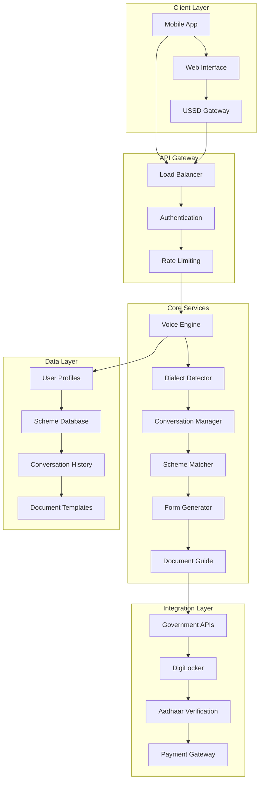

# Design Document: Gram Sahayak

## Overview

Gram Sahayak is architected as a cloud-native, microservices-based voice-first AI assistant that bridges the digital divide for rural India's government welfare access. The system combines real-time voice streaming, advanced dialect detection, and intelligent scheme matching to transform complex bureaucratic processes into natural conversations.

The architecture prioritizes low-latency voice processing (sub-500ms response times), offline-first capabilities for poor connectivity areas, and seamless integration with India's Digital Public Infrastructure (DPI) including Aadhaar, DigiLocker, and government scheme portals.

Key technical innovations include:
- WebRTC-based real-time voice streaming with adaptive bitrate for varying network conditions
- Multi-model dialect detection using IndicWhisper and custom fine-tuned models
- Graph-based scheme matching engine with 700+ government programs
- Natural language to structured form conversion using large language models
- Hybrid cloud-edge deployment for offline capability

## Architecture

The system follows a microservices architecture with clear separation of concerns:



**Deployment Strategy:**
- Primary cloud deployment on AWS/Azure with regional data centers
- Edge computing nodes in district headquarters for reduced latency
- Offline-capable mobile applications with local processing
- CDN distribution for static assets and common responses

## Components and Interfaces

### Voice Engine Service

**Responsibilities:**
- Real-time speech-to-text conversion using WebRTC streams
- Text-to-speech synthesis in detected dialects
- Audio preprocessing and noise reduction
- Voice activity detection and turn-taking management

**Technology Stack:**
- WebRTC for real-time audio streaming
- IndicWhisper for Indian language ASR (95% accuracy target)
- Custom TTS models trained on IndicVoices-R dataset
- Voice Activity Detection using WebRTC VAD algorithms

**Key Interfaces:**
```typescript
interface VoiceEngine {
  startVoiceSession(userId: string, preferredLanguage?: string): Promise<SessionId>
  processAudioStream(sessionId: SessionId, audioChunk: ArrayBuffer): Promise<TranscriptionResult>
  synthesizeSpeech(text: string, dialect: DialectCode, voice: VoiceProfile): Promise<AudioBuffer>
  endVoiceSession(sessionId: SessionId): Promise<SessionSummary>
}
```

### Dialect Detection Service

**Responsibilities:**
- Real-time identification of Indian languages and dialects
- Confidence scoring and fallback handling
- Code-switching detection for mixed-language speech
- Continuous learning from user interactions

**Technology Stack:**
- Multi-model ensemble combining acoustic and linguistic features
- Fine-tuned models on RESPIN-S1.0 dataset (10,000+ hours across 9 languages)
- Transformer-based architecture for sequence modeling
- Real-time inference with <3 second detection time

**Key Interfaces:**
```typescript
interface DialectDetector {
  detectDialect(audioFeatures: AudioFeatures): Promise<DialectResult>
  updateConfidence(sessionId: SessionId, userFeedback: FeedbackData): Promise<void>
  getSupportedDialects(): Promise<DialectInfo[]>
}
```

### Scheme Matching Engine

**Responsibilities:**
- Eligibility assessment across 700+ government schemes
- Multi-criteria matching (income, caste, age, location, occupation)
- Priority ranking based on benefit amount and application ease
- Real-time scheme database updates

**Technology Stack:**
- Graph database (Neo4j) for complex eligibility relationships
- Rule engine for dynamic criteria evaluation
- Machine learning models for benefit prediction
- Integration with myScheme API and e-Shram platform

**Key Interfaces:**
```typescript
interface SchemeMatcher {
  findEligibleSchemes(userProfile: UserProfile): Promise<SchemeMatch[]>
  evaluateEligibility(schemeId: string, userProfile: UserProfile): Promise<EligibilityResult>
  updateSchemeDatabase(schemes: SchemeUpdate[]): Promise<void>
  getPriorityRanking(schemes: SchemeMatch[], preferences: UserPreferences): Promise<RankedScheme[]>
}
```

### Form Generation Service

**Responsibilities:**
- Natural language to structured form conversion
- Multi-turn conversation management for data collection
- PDF generation for government submission
- Form validation and error handling

**Technology Stack:**
- Large Language Model fine-tuned on government forms
- Template engine for PDF generation
- Conversation state management using Redis
- Form validation using JSON Schema

**Key Interfaces:**
```typescript
interface FormGenerator {
  startFormFilling(schemeId: string, userId: string): Promise<FormSession>
  processUserResponse(sessionId: string, response: string): Promise<FormUpdate>
  generatePDF(sessionId: string): Promise<PDFDocument>
  validateForm(formData: FormData, schemeId: string): Promise<ValidationResult>
}
```

### Document Guidance Service

**Responsibilities:**
- Document requirement explanation in user's language
- Alternative document suggestions
- Step-by-step acquisition guidance
- Document verification and validation

**Technology Stack:**
- Document template database with multilingual descriptions
- OCR integration for document verification
- Integration with DigiLocker for digital document access
- Workflow engine for guidance steps

## Data Models

### User Profile
```typescript
interface UserProfile {
  userId: string
  personalInfo: {
    name: string
    age: number
    gender: Gender
    phoneNumber: string
    aadhaarNumber?: string
  }
  demographics: {
    state: string
    district: string
    block: string
    village: string
    caste: CasteCategory
    religion: Religion
    familySize: number
  }
  economic: {
    annualIncome: number
    occupation: Occupation
    landOwnership: LandDetails
    bankAccount: BankDetails
  }
  preferences: {
    preferredLanguage: LanguageCode
    preferredDialect: DialectCode
    communicationMode: CommunicationMode
  }
  applicationHistory: ApplicationRecord[]
}
```

### Scheme Information
```typescript
interface SchemeInfo {
  schemeId: string
  name: MultilangText
  description: MultilangText
  eligibilityCriteria: EligibilityCriteria
  benefits: BenefitDetails
  applicationProcess: ProcessStep[]
  requiredDocuments: DocumentRequirement[]
  deadlines: ImportantDate[]
  contactInfo: ContactDetails
  lastUpdated: Date
}
```

### Conversation Context
```typescript
interface ConversationContext {
  sessionId: string
  userId: string
  currentIntent: Intent
  conversationHistory: Message[]
  extractedEntities: EntityMap
  formProgress: FormProgress
  detectedDialect: DialectInfo
  confidenceScores: ConfidenceMap
}
```

Now I need to use the prework tool to analyze the acceptance criteria before writing the Correctness Properties section.
## Correctness Properties

*A property is a characteristic or behavior that should hold true across all valid executions of a system—essentially, a formal statement about what the system should do. Properties serve as the bridge between human-readable specifications and machine-verifiable correctness guarantees.*

### Property 1: Speech Recognition Accuracy
*For any* audio input in supported Indian languages, the Voice_Engine should achieve 95% transcription accuracy under both clean and noisy conditions, with graceful degradation based on audio quality
**Validates: Requirements 1.1, 1.3**

### Property 2: Voice Activity Detection
*For any* speech input with pauses, the Voice_Engine should correctly identify speech boundaries and wait for completion before processing, maintaining conversation flow
**Validates: Requirements 1.5**

### Property 3: Network Resilience
*For any* network condition (poor connectivity, offline, slow), the system should provide appropriate functionality with graceful degradation and automatic recovery when connectivity improves
**Validates: Requirements 1.4, 8.1, 8.2, 8.3, 8.4, 8.5**

### Property 4: Comprehensive Dialect Handling
*For any* supported Indian language or dialect, the Dialect_Detector should identify the specific variant within 3 seconds, handle code-switching, and maintain semantic understanding across regional variations
**Validates: Requirements 2.1, 2.2, 2.3, 2.4**

### Property 5: Model Update Continuity
*For any* language model update, the system should incorporate new capabilities without service interruption or degradation of existing functionality
**Validates: Requirements 2.5**

### Property 6: Comprehensive Scheme Matching
*For any* user profile with demographic information, the Scheme_Matcher should identify all eligible schemes, evaluate them against multiple criteria (income, caste, age, gender, occupation, location), and rank them by benefit and ease of application
**Validates: Requirements 3.1, 3.2, 3.3**

### Property 7: Scheme Database Freshness
*For any* change in government scheme criteria, the Knowledge_Base should reflect updates within 24 hours while maintaining system availability
**Validates: Requirements 3.4**

### Property 8: Alternative Scheme Suggestions
*For any* user ineligible for requested schemes, the Scheme_Matcher should provide relevant alternative programs based on user profile and preferences
**Validates: Requirements 3.5**

### Property 9: Comprehensive Form Processing
*For any* government scheme application, the Form_Generator should collect information through natural conversation, handle incomplete responses with appropriate follow-ups, map conversational input to correct form fields, convert to required formats, and generate valid PDF documents
**Validates: Requirements 4.2, 4.3, 4.4, 4.5**

### Property 10: Comprehensive Document Guidance
*For any* scheme requiring documentation, the Document_Guide should provide complete multilingual document lists, explain alternatives, provide acquisition guidance, offer examples and templates, and give step-by-step instructions
**Validates: Requirements 5.1, 5.2, 5.3, 5.4, 5.5**

### Property 11: Complete Application Lifecycle Management
*For any* application submission, the Application_Tracker should handle submission to correct portals, provide confirmation details, track status updates, notify of additional requirements, and explain final outcomes with clear reasoning
**Validates: Requirements 6.1, 6.2, 6.3, 6.4, 6.5**

### Property 12: User Profile Management
*For any* user interaction, the User_Profile should securely collect and store information on first use, recognize returning users with context loading, allow voice-based updates, support complete data deletion, and maintain separate profiles for family members
**Validates: Requirements 7.1, 7.2, 7.3, 7.4, 7.5**

### Property 13: Comprehensive Data Protection
*For any* personal data in the system, all information should be encrypted at rest and in transit, conversations should be anonymized after processing, government portal access should use secure tokens, and user-requested deletions should be completed within 30 days
**Validates: Requirements 9.1, 9.2, 9.3, 9.4, 9.5**

### Property 14: Multi-Modal Accessibility
*For any* user with accessibility needs, the system should provide text alternatives to voice input, display transcriptions for audio output, show visual confirmations of forms, offer button-based navigation, and support screen readers and assistive technologies
**Validates: Requirements 10.1, 10.2, 10.3, 10.4, 10.5**

## Error Handling

The system implements comprehensive error handling across all components:

**Voice Processing Errors:**
- Audio quality too poor for recognition → Request user to speak closer to device or find quieter location
- Unsupported language detected → Gracefully inform user of supported languages and offer alternatives
- Network timeout during streaming → Switch to offline mode with cached models

**Dialect Detection Errors:**
- Low confidence in dialect identification → Ask clarifying questions in detected primary language
- Code-switching detection failure → Fall back to primary detected language with confidence warnings
- Model loading failures → Use cached models with reduced accuracy warnings

**Scheme Matching Errors:**
- Incomplete user profile → Guide user through missing information collection
- No eligible schemes found → Suggest profile updates or alternative programs
- Government API failures → Use cached scheme data with staleness warnings

**Form Generation Errors:**
- Invalid user responses → Provide examples and re-prompt for correct format
- PDF generation failures → Offer alternative formats or manual form completion
- Missing required fields → Clearly identify and request missing information

**Integration Errors:**
- Government portal unavailable → Queue submissions for retry with user notification
- Authentication failures → Guide user through re-authentication process
- Document upload failures → Provide alternative submission methods

## Testing Strategy

The testing approach combines unit testing for specific scenarios with property-based testing for comprehensive coverage:

**Unit Testing Focus:**
- Specific examples of successful voice recognition in each supported language
- Edge cases like very short utterances, long pauses, and background noise scenarios
- Integration points between microservices
- Error conditions and recovery mechanisms
- Government API integration scenarios

**Property-Based Testing Configuration:**
- **Framework:** Hypothesis for Python services, fast-check for TypeScript services
- **Test Iterations:** Minimum 100 iterations per property test
- **Data Generation:** Custom generators for Indian names, addresses, demographic data, and audio samples
- **Tagging Format:** Each test tagged with **Feature: gram-sahayak, Property {number}: {property_text}**

**Property Test Implementation:**
Each correctness property will be implemented as a single property-based test that:
1. Generates random valid inputs within the property domain
2. Executes the system behavior
3. Verifies the expected property holds
4. Reports any counterexamples for debugging

**Integration Testing:**
- End-to-end voice conversation flows
- Government portal integration with test environments
- Multi-language conversation scenarios
- Offline-to-online synchronization testing

**Performance Testing:**
- Voice recognition latency under various network conditions
- Concurrent user load testing
- Memory usage during long conversations
- Database query performance with large scheme datasets

**Security Testing:**
- Data encryption verification
- Authentication and authorization flows
- Privacy compliance validation
- Penetration testing for voice data handling

The dual testing approach ensures both concrete functionality validation through unit tests and comprehensive correctness verification through property-based testing, providing confidence in the system's reliability across the diverse conditions of rural India.